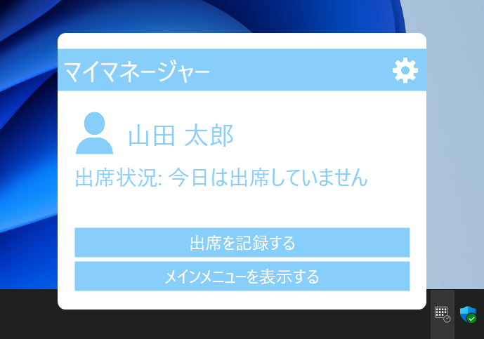

# My Manager Extension
マイマネージャーをより使いやすくするPC用拡張機能。

## ソフトウェアの概要
My Manager Extensionはユーザーがマイマネージャーをより便利に使えるようにするためのWindows専用ソフトウェアです。  
※マイマネージャーについて、詳しくは[こちら](https://github.com/bigbamboo-jp/my-manager-ja)をご覧ください。  
このソフトウェアは以下の機能を提供します。
- タスクトレイから簡単にマイマネージャーの各機能にアクセスする
- PCを起動してから一定時間が経過しても出席の記録をしていない場合にリマインダーを表示する（記録忘れ防止）
- 出席を記録してから一定時間が経過した際に作業の中断を促すリマインダーを表示（過労の防止）

※機能の有効・無効、リマインダーを表示するまでの待機時間は設定で変更できます。
## 動作環境
Windows 10、11（64bit）  
※インターネット接続環境が必要です。
## 使い始める
1. インストーラーのダウンロード  
下のリンクから最新のインストーラーをダウンロードしてください。  
[https://github.com/bigbamboo-jp/my-manager-extension-ja/releases](https://github.com/bigbamboo-jp/my-manager-extension-ja/releases)
1. インストール  
ダウンロードしたインストーラーを実行してソフトウェアをインストールしてください。
※インストールには管理者権限が必要です。
1. サービスへのログイン  
インストールが完了すると、タスクトレイにカレンダーと時計が合体したアイコンが表示されます。  
そのアイコンを左クリックしてメニューを表示させた後、その中にあるログインボタンをクリックしてください。  
後は画面の指示に従って進めればログインが完了します。
1. 設定のカスタマイズ  
タスクトレイのアイコンを左クリックして表示されるメニューの右上にある歯車をクリックすると、設定のカスタマイズを行うことができます。
## 他言語への対応について
現在、このプロジェクトはソフトウェア・ドキュメント共に日本語版のみ製作しています。  
今後、時間ができたときに他言語版も製作して公開する予定です。
## ライセンス
[LICENSE](LICENSE)を参照してください。